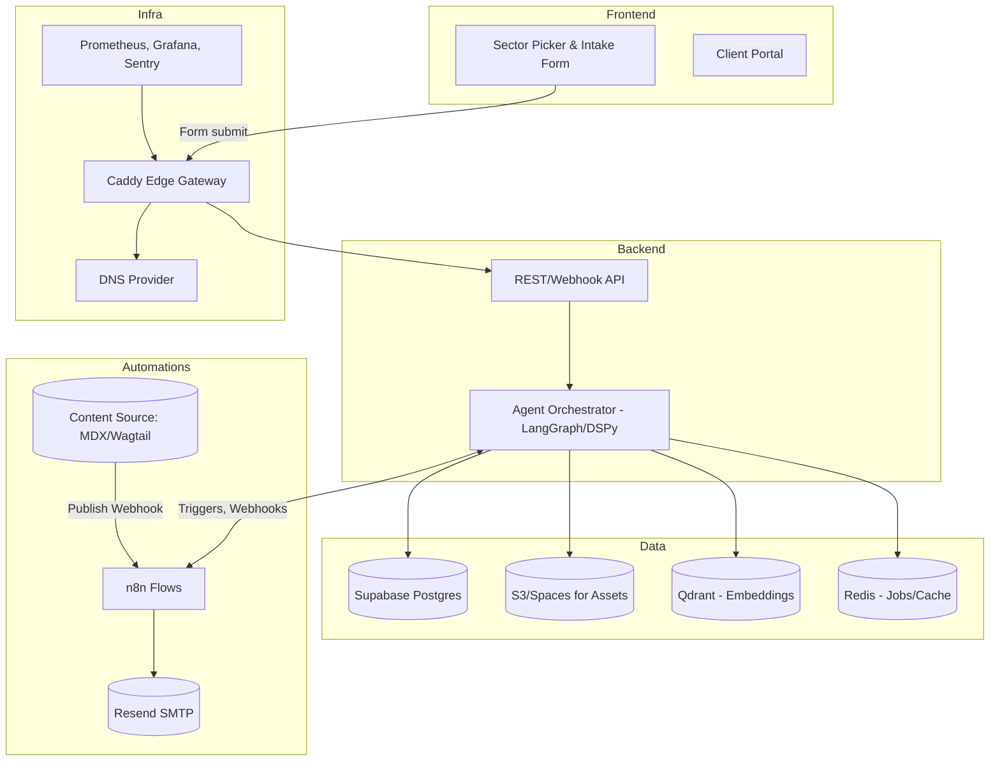
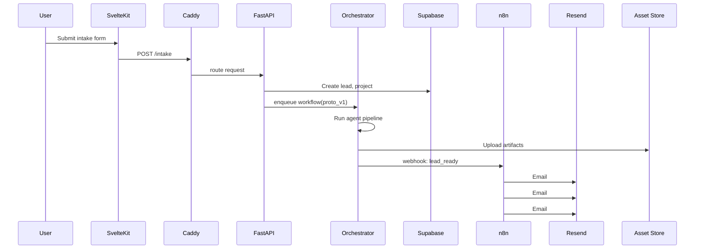
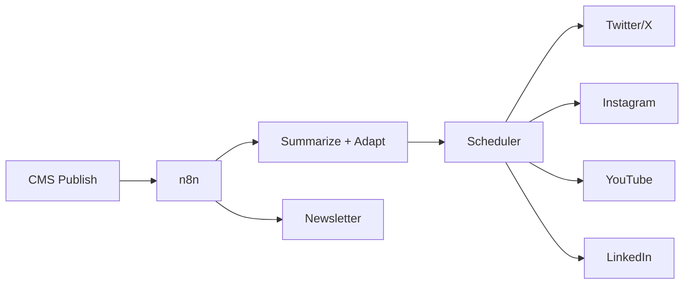

# System Architecture - Autonomous AI Agency

**Version:** 1.0  
**Last Updated:** 2025-10-04  
**Project:** RoboAgency - Humachine AI Studio

---

## Executive Summary

This document describes the technical architecture for an autonomous AI agency that pairs human creativity and judgment with machine efficiency and scale. The system follows the **4-I model** (Intentionality → Integration → Implementation → Indication) and embodies **Kasparov's Law**: weak human + machine + better process > strong computer alone.

**Core Principle:** Automate the repetitive, augment the creative, and always close the feedback loop.

---

## Table of Contents

1. [High-Level Architecture](#high-level-architecture)
2. [Service Definitions](#service-definitions)
3. [Technology Stack](#technology-stack)
4. [Data Flow](#data-flow)
5. [Deployment Architecture](#deployment-architecture)
6. [Scalability & Performance](#scalability--performance)
7. [Integration Points](#integration-points)

---

## High-Level Architecture



---

## Service Definitions

### 1. Frontend Service (SvelteKit)

**Purpose:** User-facing web application for client interaction and project intake.

**Port:** 3000  
**Container:** `frontend_service`

**Features:**
- Sector selection interface
- Multi-step intake form
- Client portal with project status
- Authentication and authorization
- Real-time status updates

**Key Files:**
```
/apps/frontend_service/
├── src/
│   ├── routes/
│   │   ├── intake/+page.svelte
│   │   ├── portal/+page.svelte
│   │   └── api/+server.ts
│   ├── lib/
│   │   ├── components/
│   │   └── stores/
│   └── app.html
├── static/
├── Dockerfile
└── package.json
```

**Environment Variables:**
```bash
PUBLIC_BASE_URL=https://agency.yourdomain.tld
PUBLIC_API_URL=https://api.yourdomain.tld/v1
```

---

### 2. Orchestrator Service (FastAPI + LangGraph/DSPy)

**Purpose:** Core AI agent orchestration engine that manages the entire project pipeline.

**Port:** 5001  
**Container:** `orchestrator_service`

**Architecture:**
```python
# Agent Graph Structure
StateGraph:
  ├── intake_parser (validates sector & intent)
  ├── market_mapper (retrieves patterns & comps)
  ├── product_doc_writer (generates PRD)
  ├── wireframer (creates low-fi layouts)
  ├── prototyper (builds Svelte components)
  ├── explainer_producer (generates demo video)
  ├── campaign_composer (creates email sequence)
  └── indication_okrs (metrics & validation)
```

**Key Files:**
```
/apps/orchestrator_service/
├── agents/
│   ├── orchestrator.py (LangGraph state machine)
│   ├── intake_parser.py
│   ├── market_mapper.py
│   ├── product_doc_writer.py
│   ├── wireframer.py
│   ├── prototyper.py
│   ├── explainer_producer.py
│   ├── campaign_composer.py
│   └── indication_okrs.py
├── api/
│   ├── main.py (FastAPI app)
│   ├── routes/
│   └── middleware/
├── models/
├── utils/
├── Dockerfile
└── requirements.txt
```

**Environment Variables:**
```bash
API_PORT=5001
SECRET_KEY=your_secret_key
OPENAI_API_KEY=sk-...
ANTHROPIC_API_KEY=sk-ant-...
SUPABASE_URL=...
QDRANT_URL=http://qdrant:6333
REDIS_URL=redis://redis:6379
```

**API Endpoints:**
- `POST /v1/intake` - Create new lead and project
- `POST /v1/workflows/{id}` - Start agent workflow
- `GET /v1/runs/{run_id}` - Get workflow status
- `POST /v1/webhooks/agent/{event}` - Internal agent events
- `GET /v1/assets/{id}` - Retrieve signed asset URLs

---

### 3. Automation Service (n8n)

**Purpose:** Workflow automation for webhooks, email campaigns, and CMS distribution.

**Port:** 8080 (external), 5678 (internal)  
**Container:** `automation_service`

**Workflows:**
1. **Lead Warmup Flow**
   - Trigger: Webhook on lead_ready
   - Steps: Wait for artifacts → Email demo → Email prototype → Email calendar

2. **Content Distribution Flow**
   - Trigger: CMS publish webhook
   - Steps: Summarize → Format for platforms → Queue posts → Send newsletter

3. **Monitoring Flow**
   - Trigger: Scheduled (hourly)
   - Steps: Health checks → Alert on failures

**Key Files:**
```
/apps/automation_service/
├── workflows/
│   ├── lead_warmup.json
│   ├── content_distribution.json
│   └── monitoring.json
├── docker-compose.n8n.yml
└── data/ (mounted volume)
```

---

### 4. Data Layer

#### 4.1 Supabase (PostgreSQL)

**Purpose:** Primary relational database for structured data.

**Schema:**
```sql
-- Core tables
leads (id, email, sector, idea, created_at)
projects (id, lead_id, status, created_at)
workflow_runs (id, project_id, name, status, metadata, created_at)
assets (id, project_id, type, url, created_at)
campaigns (id, project_id, emails_sent, created_at)
```

#### 4.2 Qdrant (Vector Database)

**Purpose:** Semantic search and retrieval-augmented generation (RAG).

**Collections:**
- `doc_chunks` - Document embeddings
- `code_patterns` - Code snippet embeddings
- `market_comps` - Industry comparison embeddings

#### 4.3 S3/DigitalOcean Spaces (Object Storage)

**Purpose:** Store generated assets (documents, videos, prototypes).

**Buckets:**
- `docs/` - PRDs, wireframes, documentation
- `videos/` - Demo videos, explainer content
- `prototypes/` - HTML/Svelte prototype files

#### 4.4 Redis (Cache & Queue)

**Purpose:** Job queues, session management, caching.

**Usage:**
- Job queues (Celery/Bull)
- API response caching
- Rate limiting counters

---

### 5. Infrastructure Layer

#### 5.1 Caddy (Edge Gateway)

**Purpose:** Edge gateway providing automatic HTTPS, host-based routing, and reverse proxy capabilities.

**Host-Based Routing:**
- `agency.yourdomain.tld` → SvelteKit frontend (port 3000)
- `api.yourdomain.tld` → FastAPI orchestrator (port 5001)
- `automations.yourdomain.tld` → n8n (port 5678, behind auth)
- `grafana.yourdomain.tld` → Grafana (port 3000, behind auth, optional)

**Configuration:**
```caddyfile
{
  email {$ACME_EMAIL}
  admin 0.0.0.0:2019
}

agency.{$DOMAIN} {
  encode gzip zstd
  reverse_proxy frontend:3000
}

api.{$DOMAIN} {
  encode gzip zstd
  reverse_proxy orchestrator:5001
}

automations.{$DOMAIN} {
  encode gzip zstd
  reverse_proxy n8n:5678
}
```

**Features:**
- Automatic HTTPS via Let's Encrypt
- Built-in metrics endpoint (internal admin port 2019)
- Security headers
- Compression (gzip, zstd)
- Rate limiting support

#### 5.2 DNS (Optional - Cloudflare or Any Provider)

**Purpose:** DNS management only (optional).

**Note:** Cloudflare can be used for DNS management only. SSL/TLS termination, WAF, and DDoS protection are handled by Caddy and server-level security (UFW, CrowdSec/fail2ban).

**DNS Records Required:**
- A records for subdomains: `agency`, `api`, `automations`, `grafana` (optional)
- MX/SPF/DKIM/DMARC records remain unchanged (Google Workspace compatibility)

#### 5.3 Monitoring & Observability

**Prometheus + Grafana:**
- **Prometheus** - Metrics collection and storage
  - Scrapes Caddy metrics from internal admin port (2019)
  - Scrapes application metrics from health endpoints
  - Internal network only (not exposed publicly)
  
- **Grafana** - Visualization and dashboards
  - Accesses Prometheus via internal network
  - Optional public access via `grafana.yourdomain.tld` (behind auth)
  - Pre-configured Caddy dashboards

**Additional Tools:**
- **Sentry** - Error tracking and performance monitoring
- **UptimeRobot** - External uptime monitoring (1-min checks)

---

## Technology Stack

### Frontend
| Technology | Version | Purpose |
|------------|---------|---------|
| SvelteKit | 2.x | Web framework |
| Tailwind CSS | 4.x | Styling |
| TypeScript | 5.x | Type safety |

### Backend
| Technology | Version | Purpose |
|------------|---------|---------|
| Python | 3.11+ | Runtime |
| FastAPI | 0.104+ | Web framework |
| LangGraph | Latest | Agent orchestration |
| DSPy | Latest | Prompt optimization |
| Celery | 5.x | Background jobs |

### Data
| Technology | Version | Purpose |
|------------|---------|---------|
| PostgreSQL | 15 | Relational DB |
| Qdrant | 1.7+ | Vector DB |
| Redis | 7.x | Cache/Queue |

### Infrastructure
| Technology | Version | Purpose |
|------------|---------|---------|
| Docker | 24+ | Containerization |
| Docker Compose | 2.x | Orchestration |
| Caddy | 2.x | Edge gateway / Reverse proxy |
| Ubuntu | 22.04 LTS | OS |

### Observability
| Technology | Version | Purpose |
|------------|---------|---------|
| Prometheus | 2.45+ | Metrics collection |
| Grafana | 10.0+ | Metrics visualization |

---

## Data Flow

### Lead Intake to Warm Lead (Primary Flow)



### Content Publishing to Omnichannel Distribution



---

## Deployment Architecture

### Development Environment

```yaml
# docker-compose.dev.yml
services:
  frontend:
    build: ./apps/frontend_service
    volumes:
      - ./apps/frontend_service:/app
    ports: ["3000:3000"]
  
  api:
    build: ./apps/orchestrator_service
    volumes:
      - ./apps/orchestrator_service:/app
    ports: ["5001:5001"]
```

### Production Environment

```yaml
# docker-compose.yml
services:
  caddy:
    image: caddy:2
    container_name: caddy
    ports:
      - "80:80"
      - "443:443"
    environment:
      - ACME_EMAIL=${ACME_EMAIL}
      - DOMAIN=${DOMAIN}
    volumes:
      - ./infra/caddy/Caddyfile:/etc/caddy/Caddyfile:ro
      - caddy_data:/data
      - caddy_config:/config
    networks: [edge, observability]
    restart: unless-stopped
    depends_on:
      - frontend
      - orchestrator
      - n8n
  
  frontend:
    build: ./apps/frontend_service
    container_name: frontend
    environment:
      - NODE_ENV=production
      - PUBLIC_BASE_URL=https://agency.${DOMAIN}
      - PUBLIC_API_URL=https://api.${DOMAIN}/v1
    expose: ["3000"]
    networks: [edge]
    restart: unless-stopped
  
  orchestrator:
    build: ./apps/orchestrator_service
    container_name: orchestrator
    environment:
      - API_PORT=5001
      - REDIS_URL=redis://redis:6379
      - QDRANT_URL=http://qdrant:6333
    expose: ["5001"]
    networks: [edge, backend]
    restart: unless-stopped
    depends_on: [redis, qdrant]
  
  redis:
    image: redis:7.2-alpine
    container_name: redis
    networks: [backend]
    restart: unless-stopped
  
  qdrant:
    image: qdrant/qdrant:latest
    container_name: qdrant
    volumes:
      - qdrant_data:/qdrant/storage
    networks: [backend]
    restart: unless-stopped
  
  n8n:
    image: n8nio/n8n:latest
    container_name: n8n
    environment:
      - N8N_HOST=automations.${DOMAIN}
      - N8N_PROTOCOL=https
      - WEBHOOK_URL=https://automations.${DOMAIN}/
      - N8N_EDITOR_BASE_URL=https://automations.${DOMAIN}/
      - N8N_ENCRYPTION_KEY=${N8N_ENCRYPTION_KEY}
    volumes:
      - n8n_data:/home/node/.n8n
    expose: ["5678"]
    networks: [edge, backend]
    restart: unless-stopped

networks:
  edge:
  backend:
  observability:

volumes:
  caddy_data:
  caddy_config:
  qdrant_data:
  n8n_data:
```

**Server Specifications (Minimum):**
- **OS:** Ubuntu 22.04 LTS
- **CPU:** 2 vCPU
- **RAM:** 4GB
- **Storage:** 40GB SSD
- **Provider:** Hetzner CX21 (€5.83/mo)

---

## Scalability & Performance

### Horizontal Scaling Strategy

1. **API Service:** Scale via Docker Compose scale command
2. **Background Jobs:** Add Celery workers horizontally
3. **Database:** Connection pooling + read replicas
4. **Cache:** Redis cluster
5. **Edge Gateway:** Caddy handles load balancing across service instances

### Performance Targets

| Metric | Target | Measurement |
|--------|--------|-------------|
| API Response | < 200ms (p95) | Sentry APM |
| Page Load | < 2s (LCP) | Lighthouse |
| Uptime | 99.9% | UptimeRobot |
| MTTR | < 15 minutes | Runbook |

---

## Integration Points

### External APIs

| Service | Purpose | Auth Method |
|---------|---------|-------------|
| OpenAI | LLM inference | API key |
| Anthropic Claude | LLM inference | API key |
| Resend | Transactional email | SMTP + API |
| DNS Provider | DNS management (optional) | Provider-specific |
| Supabase | Database | Service key |

### Webhooks

**Inbound:**
- `POST /webhooks/cms/publish` - Content publish events
- `POST /webhooks/stripe` - Payment events (future)

**Outbound:**
- n8n flows triggered by agent events
- Email campaigns triggered by workflow completion

---

## Security Architecture

### Defense in Depth

1. **Perimeter:** UFW firewall (ports 22, 80, 443 only) + optional CrowdSec/fail2ban
2. **Edge:** Caddy with automatic HTTPS + security headers + rate limiting
3. **Network:** Internal Docker networks (edge, backend, observability) isolate services
4. **Application:** Input validation + rate limiting
5. **Data:** Encryption at rest + in transit
6. **Access:** SSH keys only + least privilege

### Network Isolation

- **Public exposure:** Only Caddy (ports 80/443) exposed to internet
- **Internal services:** Redis, Qdrant, Prometheus, Grafana on internal networks only
- **Metrics:** Caddy admin port (2019) accessible only via observability network

### Secrets Management

```bash
# .env.production (never commit)
SECRET_KEY=<generated>
OPENAI_API_KEY=sk-...
SUPABASE_SERVICE_KEY=<secret>
```

**Storage:** Server-side only, environment variables.

---

## Monitoring & Alerting

### Health Checks

Each service exposes:
```
GET /health
{
  "status": "healthy",
  "version": "1.0.0",
  "dependencies": {
    "database": "up",
    "redis": "up"
  }
}
```

### Alerting Rules

1. **Critical:** Any service down → Alert immediately
2. **High:** Error rate > 1% → Alert within 5 min
3. **Medium:** Response time > 500ms → Alert within 15 min
4. **Low:** Disk usage > 80% → Alert within 1 hour

---

## Next Steps

1. **Week 1:** Set up local development environment
2. **Week 2:** Deploy to staging with Docker Compose
3. **Week 3:** Implement core agent pipeline
4. **Week 4:** Production deployment + monitoring

---

**Document Version:** 2.0  
**Last Review Date:** 2025-01-XX  
**Next Review Date:** 2025-02-XX

