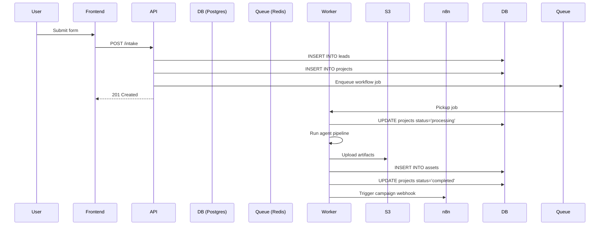

# Data Model & Storage

**Version:** 1.0  
**Last Updated:** 2025-10-04  
**Project:** RoboAgency - Humachine AI Studio

---

## Overview

This document defines the data architecture for the autonomous AI agency, including relational database schemas, vector stores, object storage, and caching strategies.

---

## Table of Contents

1. [Database Schema (PostgreSQL)](#database-schema-postgresql)
2. [Vector Database (Qdrant)](#vector-database-qdrant)
3. [Object Storage (S3/Spaces)](#object-storage-s3spaces)
4. [Cache & Queues (Redis)](#cache--queues-redis)
5. [Data Flow](#data-flow)
6. [Backup & Recovery](#backup--recovery)

---

## Database Schema (PostgreSQL)

### Entity-Relationship Diagram

```
┌──────────┐         ┌──────────────┐         ┌───────────────┐
│  leads   │────────▶│   projects   │────────▶│ workflow_runs │
└──────────┘         └──────────────┘         └───────────────┘
                             │
                             │
                             ▼
                      ┌──────────┐
                      │  assets  │
                      └──────────┘
                             │
                             │
                             ▼
                      ┌───────────┐
                      │ campaigns │
                      └───────────┘
```

---

### Table: leads

Stores information about potential clients who submit the intake form.

```sql
CREATE TABLE leads (
  id UUID PRIMARY KEY DEFAULT gen_random_uuid(),
  email VARCHAR(255) NOT NULL UNIQUE,
  name VARCHAR(255),
  sector VARCHAR(50) NOT NULL,
  idea TEXT NOT NULL,
  constraints JSONB,
  status VARCHAR(50) DEFAULT 'new',
  source VARCHAR(50) DEFAULT 'website',
  created_at TIMESTAMPTZ DEFAULT NOW(),
  updated_at TIMESTAMPTZ DEFAULT NOW(),
  
  CONSTRAINT valid_sector CHECK (sector IN (
    'healthtech', 'fintech', 'edtech', 'saas', 'ecommerce', 'other'
  )),
  CONSTRAINT valid_status CHECK (status IN (
    'new', 'contacted', 'qualified', 'converted', 'lost'
  ))
);

-- Indexes
CREATE INDEX idx_leads_email ON leads(email);
CREATE INDEX idx_leads_sector ON leads(sector);
CREATE INDEX idx_leads_created_at ON leads(created_at DESC);
CREATE INDEX idx_leads_status ON leads(status);
```

**Sample Data:**

```sql
INSERT INTO leads (email, name, sector, idea, constraints) VALUES
  ('john@example.com', 'John Doe', 'healthtech', 'Telemedicine app for rural areas', 
   '{"budget": "50k", "timeline": "3 months"}'),
  ('jane@example.com', 'Jane Smith', 'fintech', 'AI-powered expense tracking',
   '{"tech_stack": "mobile-first", "target_users": "freelancers"}');
```

---

### Table: projects

Represents a project created from a lead.

```sql
CREATE TABLE projects (
  id UUID PRIMARY KEY DEFAULT gen_random_uuid(),
  lead_id UUID NOT NULL REFERENCES leads(id) ON DELETE CASCADE,
  name VARCHAR(255),
  status VARCHAR(50) DEFAULT 'queued',
  sector VARCHAR(50) NOT NULL,
  description TEXT,
  goals TEXT[],
  target_audience TEXT[],
  key_features TEXT[],
  market_analysis JSONB,
  metadata JSONB,
  created_at TIMESTAMPTZ DEFAULT NOW(),
  updated_at TIMESTAMPTZ DEFAULT NOW(),
  
  CONSTRAINT valid_status CHECK (status IN (
    'queued', 'processing', 'completed', 'failed', 'cancelled'
  ))
);

-- Indexes
CREATE INDEX idx_projects_lead_id ON projects(lead_id);
CREATE INDEX idx_projects_status ON projects(status);
CREATE INDEX idx_projects_created_at ON projects(created_at DESC);

-- Full-text search on description
CREATE INDEX idx_projects_description_fts ON projects USING GIN (to_tsvector('english', description));
```

---

### Table: workflow_runs

Tracks execution of agent workflows.

```sql
CREATE TABLE workflow_runs (
  id UUID PRIMARY KEY DEFAULT gen_random_uuid(),
  project_id UUID NOT NULL REFERENCES projects(id) ON DELETE CASCADE,
  workflow_name VARCHAR(100) NOT NULL,
  status VARCHAR(50) DEFAULT 'queued',
  started_at TIMESTAMPTZ,
  completed_at TIMESTAMPTZ,
  duration_seconds INTEGER,
  steps_completed INTEGER DEFAULT 0,
  steps_total INTEGER DEFAULT 8,
  current_step VARCHAR(100),
  metadata JSONB,
  error_message TEXT,
  created_at TIMESTAMPTZ DEFAULT NOW(),
  
  CONSTRAINT valid_status CHECK (status IN (
    'queued', 'running', 'completed', 'failed', 'cancelled'
  ))
);

-- Indexes
CREATE INDEX idx_workflow_runs_project_id ON workflow_runs(project_id);
CREATE INDEX idx_workflow_runs_status ON workflow_runs(status);
CREATE INDEX idx_workflow_runs_started_at ON workflow_runs(started_at DESC);
```

**Sample Query:**

```sql
-- Get all running workflows
SELECT 
  wr.id,
  wr.workflow_name,
  wr.current_step,
  wr.started_at,
  p.name AS project_name,
  l.email AS lead_email
FROM workflow_runs wr
JOIN projects p ON wr.project_id = p.id
JOIN leads l ON p.lead_id = l.id
WHERE wr.status = 'running'
ORDER BY wr.started_at DESC;
```

---

### Table: assets

Stores references to generated artifacts (PRDs, prototypes, videos).

```sql
CREATE TABLE assets (
  id UUID PRIMARY KEY DEFAULT gen_random_uuid(),
  project_id UUID NOT NULL REFERENCES projects(id) ON DELETE CASCADE,
  type VARCHAR(50) NOT NULL,
  url TEXT NOT NULL,
  filename VARCHAR(255),
  content_type VARCHAR(100),
  size_bytes BIGINT,
  metadata JSONB,
  created_at TIMESTAMPTZ DEFAULT NOW(),
  
  CONSTRAINT valid_type CHECK (type IN (
    'prd', 'wireframe', 'prototype', 'demo_video', 'script', 'other'
  ))
);

-- Indexes
CREATE INDEX idx_assets_project_id ON assets(project_id);
CREATE INDEX idx_assets_type ON assets(type);
CREATE INDEX idx_assets_created_at ON assets(created_at DESC);
```

**Sample Data:**

```sql
INSERT INTO assets (project_id, type, url, filename, content_type, size_bytes) VALUES
  ('abc-123', 'prd', 'https://assets.example.com/prd.md', 'prd.md', 'text/markdown', 12845),
  ('abc-123', 'prototype', 'https://assets.example.com/index.html', 'index.html', 'text/html', 45678),
  ('abc-123', 'demo_video', 'https://assets.example.com/demo.mp4', 'demo.mp4', 'video/mp4', 5242880);
```

---

### Table: campaigns

Tracks email campaigns sent to leads.

```sql
CREATE TABLE campaigns (
  id UUID PRIMARY KEY DEFAULT gen_random_uuid(),
  project_id UUID NOT NULL REFERENCES projects(id) ON DELETE CASCADE,
  lead_id UUID NOT NULL REFERENCES leads(id) ON DELETE CASCADE,
  type VARCHAR(50) DEFAULT 'warmup',
  status VARCHAR(50) DEFAULT 'scheduled',
  emails_sent INTEGER DEFAULT 0,
  emails_opened INTEGER DEFAULT 0,
  emails_clicked INTEGER DEFAULT 0,
  last_email_sent_at TIMESTAMPTZ,
  metadata JSONB,
  created_at TIMESTAMPTZ DEFAULT NOW(),
  
  CONSTRAINT valid_type CHECK (type IN (
    'warmup', 'nurture', 'followup', 'newsletter'
  )),
  CONSTRAINT valid_status CHECK (status IN (
    'scheduled', 'active', 'completed', 'cancelled'
  ))
);

-- Indexes
CREATE INDEX idx_campaigns_project_id ON campaigns(project_id);
CREATE INDEX idx_campaigns_lead_id ON campaigns(lead_id);
CREATE INDEX idx_campaigns_status ON campaigns(status);
```

---

### Views

#### Active Projects Dashboard

```sql
CREATE VIEW active_projects_dashboard AS
SELECT 
  p.id,
  p.name,
  p.sector,
  p.status,
  l.email AS lead_email,
  l.name AS lead_name,
  wr.workflow_name,
  wr.current_step,
  COUNT(DISTINCT a.id) AS assets_count,
  p.created_at,
  wr.started_at AS workflow_started_at
FROM projects p
LEFT JOIN leads l ON p.lead_id = l.id
LEFT JOIN workflow_runs wr ON p.id = wr.project_id
LEFT JOIN assets a ON p.id = a.project_id
WHERE p.status IN ('processing', 'queued')
GROUP BY p.id, l.email, l.name, wr.workflow_name, wr.current_step, wr.started_at
ORDER BY p.created_at DESC;
```

---

## Vector Database (Qdrant)

### Collections

#### Collection: market_comps

Stores embeddings of market analysis and competitive products.

```python
from qdrant_client import QdrantClient
from qdrant_client.models import Distance, VectorParams, PointStruct

client = QdrantClient(url="http://qdrant:6333")

# Create collection
client.create_collection(
    collection_name="market_comps",
    vectors_config=VectorParams(size=1536, distance=Distance.COSINE)
)

# Insert points
client.upsert(
    collection_name="market_comps",
    points=[
        PointStruct(
            id="comp-001",
            vector=[0.1, 0.2, ..., 0.9],  # 1536 dimensions
            payload={
                "sector": "healthtech",
                "product_name": "Teladoc",
                "description": "Leading telemedicine platform...",
                "key_features": ["video calls", "EHR integration", "scheduling"],
                "target_market": "US patients",
                "pricing_model": "subscription"
            }
        )
    ]
)
```

**Query Example:**

```python
# Semantic search for similar products
results = client.search(
    collection_name="market_comps",
    query_vector=embedding,
    query_filter={
        "must": [
            {"key": "sector", "match": {"value": "healthtech"}}
        ]
    },
    limit=5
)
```

---

#### Collection: doc_chunks

Stores embeddings of documentation, PRDs, and knowledge base articles.

```python
client.create_collection(
    collection_name="doc_chunks",
    vectors_config=VectorParams(size=1536, distance=Distance.COSINE)
)

# Insert document chunks
client.upsert(
    collection_name="doc_chunks",
    points=[
        PointStruct(
            id="doc-001",
            vector=chunk_embedding,
            payload={
                "doc_id": "prd-healthtech-template",
                "chunk_text": "User Story: As a patient, I want to...",
                "doc_type": "prd_template",
                "sector": "healthtech"
            }
        )
    ]
)
```

---

#### Collection: code_patterns

Stores embeddings of code snippets and component templates.

```python
client.create_collection(
    collection_name="code_patterns",
    vectors_config=VectorParams(size=1536, distance=Distance.COSINE)
)

# Insert code patterns
client.upsert(
    collection_name="code_patterns",
    points=[
        PointStruct(
            id="code-001",
            vector=code_embedding,
            payload={
                "pattern_name": "authentication_form",
                "framework": "svelte",
                "code": "<script>...</script>",
                "tags": ["auth", "form", "validation"]
            }
        )
    ]
)
```

---

## Object Storage (S3/Spaces)

### Bucket Structure

```
roboagency-assets/
├── projects/
│   ├── {project_id}/
│   │   ├── docs/
│   │   │   ├── prd.md
│   │   │   └── wireframe.json
│   │   ├── prototypes/
│   │   │   └── index.html
│   │   └── videos/
│   │       └── demo.mp4
├── templates/
│   ├── prd_templates/
│   ├── email_templates/
│   └── component_templates/
└── exports/
    └── backups/
```

### Access Patterns

```python
import boto3
from botocore.config import Config

# Initialize S3 client
s3 = boto3.client(
    's3',
    endpoint_url='https://nyc3.digitaloceanspaces.com',
    aws_access_key_id=SPACES_KEY,
    aws_secret_access_key=SPACES_SECRET,
    config=Config(signature_version='s3v4')
)

# Upload file
s3.upload_file(
    Filename='local_file.html',
    Bucket='roboagency-assets',
    Key='projects/abc123/prototypes/index.html',
    ExtraArgs={
        'ACL': 'private',
        'ContentType': 'text/html',
        'CacheControl': 'max-age=3600'
    }
)

# Generate signed URL (1 hour expiry)
signed_url = s3.generate_presigned_url(
    'get_object',
    Params={
        'Bucket': 'roboagency-assets',
        'Key': 'projects/abc123/prototypes/index.html'
    },
    ExpiresIn=3600
)
```

---

## Cache & Queues (Redis)

### Data Structures

#### Job Queues (Celery)

```python
# Queue structure
roboagency:queue:high
roboagency:queue:default
roboagency:queue:low

# Job format
{
  "id": "task-123",
  "task": "agents.orchestrator.run_workflow",
  "args": ["proto_v1", "project-abc123"],
  "kwargs": {},
  "eta": null,
  "priority": 5
}
```

#### Session Storage

```python
import redis

r = redis.Redis(host='redis', port=6379, decode_responses=True)

# Store session
r.setex(
    f"session:{session_id}",
    3600,  # 1 hour expiry
    json.dumps({
        "user_id": "abc123",
        "email": "user@example.com",
        "created_at": datetime.utcnow().isoformat()
    })
)
```

#### API Response Cache

```python
# Cache API responses for 5 minutes
@cached(ttl=300, key_prefix="api:runs")
async def get_run_status(run_id: str):
    return await db.table("workflow_runs").select("*").eq("id", run_id).execute()
```

#### Rate Limiting

```python
# Rate limit: 10 requests per hour per IP
key = f"ratelimit:intake:{ip_address}"
count = r.incr(key)
if count == 1:
    r.expire(key, 3600)  # 1 hour window
if count > 10:
    raise RateLimitExceeded()
```

---

## Data Flow

### Lead Intake to Campaign



---

## Backup & Recovery

### Automated Backups

```bash
# Daily database backup (cron)
0 2 * * * pg_dump -h localhost -U postgres roboagency | gzip > /backups/db_$(date +\%Y\%m\%d).sql.gz

# Retain 7 days of daily backups
find /backups -name "db_*.sql.gz" -mtime +7 -delete
```

### S3 Backup

```python
# Sync S3 to backup location (weekly)
import boto3

s3 = boto3.resource('s3')
bucket = s3.Bucket('roboagency-assets')

for obj in bucket.objects.all():
    backup_key = f"backups/{datetime.now().strftime('%Y-%m')}/{obj.key}"
    s3.Object('roboagency-backups', backup_key).copy_from(
        CopySource={'Bucket': 'roboagency-assets', 'Key': obj.key}
    )
```

### Restore Procedures

```bash
# Restore database from backup
gunzip < /backups/db_20251004.sql.gz | psql -h localhost -U postgres roboagency

# Verify data integrity
psql -h localhost -U postgres roboagency -c "SELECT COUNT(*) FROM leads;"
```

---

## Next Steps

1. **Initialize** database schema with migrations
2. **Seed** vector database with templates
3. **Configure** S3 buckets and permissions
4. **Set up** Redis for caching
5. **Test** backup and restore procedures

---

**Document Version:** 1.0  
**Last Review Date:** 2025-10-04  
**Next Review Date:** 2025-11-04

