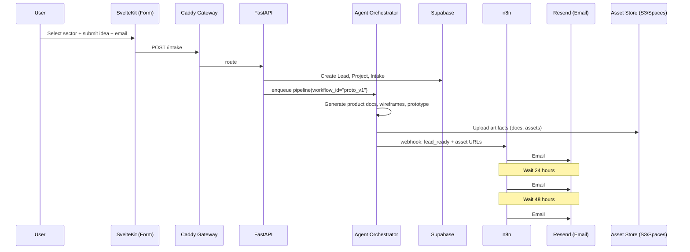
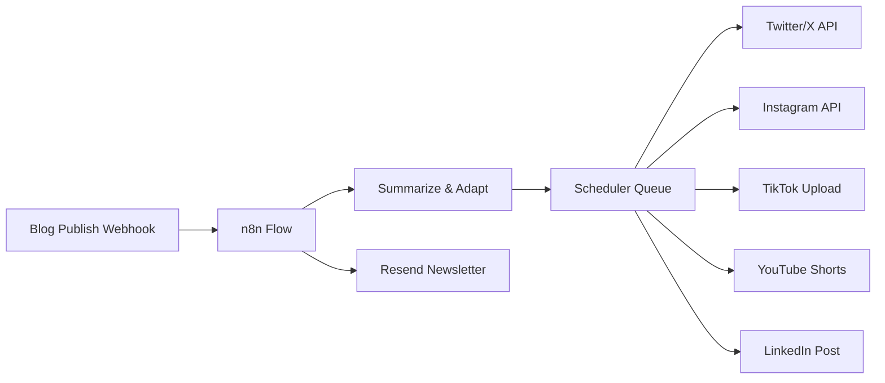

# Core Workflows & Processes

**Version:** 2.0  
**Last Updated:** 2025-12-14  
**Project:** RoboAgency - Humachine AI Studio

---

## Changelog

### Version 2.0 (2025-12-14)
- Updated file path from `apps/frontend_service/` to `apps/frontend/`
- Fixed intake form route path in code example

### Version 1.0 (2025-10-04)
- Initial workflows documentation

---

## Overview

This document defines the core operational workflows that power the autonomous AI agency. Each workflow embodies the **4-I model**: Intentionality (clear purpose) → Integration (humans + agents) → Implementation (execution) → Indication (feedback).

---

## Table of Contents

1. [Lead Generation Workflow](#1-lead-generation-workflow)
2. [Content Distribution Workflow](#2-content-distribution-workflow)
3. [Agent Orchestration Pipeline](#3-agent-orchestration-pipeline)
4. [Error Handling & Recovery](#4-error-handling--recovery)
5. [Monitoring & Health Checks](#5-monitoring--health-checks)

---

## 1. Lead Generation Workflow

### Overview

Transform cold inquiries into warm, qualified leads with automated demos, prototypes, and scheduling—all without human intervention.

### Flow Diagram



### Step-by-Step Process

#### Step 1: Intake Form Submission
**Actor:** User  
**System:** SvelteKit Frontend

```typescript
// apps/frontend/src/routes/intake/+page.server.ts
export const actions = {
  default: async ({ request, fetch }) => {
    const data = Object.fromEntries(await request.formData());
    
    const payload = {
      sector: data.sector,      // e.g., "healthtech"
      idea: data.idea,          // free-form description
      email: data.email,
      constraints: data.constraints || null
    };
    
    const res = await fetch("/api/intake", {
      method: "POST",
      headers: { "Content-Type": "application/json" },
      body: JSON.stringify(payload)
    });
    
    return { ok: res.ok, lead_id: (await res.json()).lead_id };
  }
};
```

**Validation:**
- Email format check
- Sector must be valid (from predefined list)
- Idea minimum 50 characters
- Rate limit: 3 submissions per IP per hour

---

#### Step 2: Lead Creation
**Actor:** FastAPI Backend  
**System:** Supabase

```python
# apps/orchestrator_service/api/routes/intake.py
@router.post("/intake")
async def create_intake(data: IntakeSchema):
    # Create lead record
    lead = await db.table("leads").insert({
        "email": data.email,
        "sector": data.sector,
        "idea": data.idea,
        "created_at": datetime.utcnow()
    }).execute()
    
    # Create associated project
    project = await db.table("projects").insert({
        "lead_id": lead.data[0]["id"],
        "status": "queued",
        "created_at": datetime.utcnow()
    }).execute()
    
    # Enqueue agent workflow
    workflow_id = await orchestrator.enqueue(
        workflow_name="proto_v1",
        project_id=project.data[0]["id"],
        input_data={"sector": data.sector, "idea": data.idea}
    )
    
    return {"lead_id": lead.data[0]["id"], "project_id": project.data[0]["id"]}
```

---

#### Step 3: Agent Pipeline Execution
**Actor:** LangGraph Orchestrator  
**System:** Agent Graph

```python
# agents/orchestrator.py
from langgraph.graph import StateGraph, END

def run_proto_v1_workflow(state):
    """
    Full pipeline: intake → PRD → wireframe → prototype → video → campaign
    """
    # 1. Parse and validate intake
    state = intake_parser(state)
    
    # 2. Market research and competitive analysis
    state = market_mapper(state)
    
    # 3. Generate Product Requirements Document
    state = product_doc_writer(state)
    
    # 4. Create wireframes (textual layout)
    state = wireframer(state)
    
    # 5. Build interactive prototype (Svelte components)
    state = prototyper(state)
    
    # 6. Generate demo video (script + voiceover + render)
    state = explainer_producer(state)
    
    # 7. Compose 3-email warmup campaign
    state = campaign_composer(state)
    
    # 8. Log metrics and validation
    state = indication_okrs(state)
    
    return state

# Build the graph
g = StateGraph()
g.add_node("intake", intake_parser)
g.add_node("prd", product_doc_writer)
g.add_node("wireframe", wireframer)
g.add_node("prototype", prototyper)
g.add_node("video", explainer_producer)
g.add_node("campaign", campaign_composer)
g.add_node("indication", indication_okrs)

g.set_entry_point("intake")
g.add_edge("intake", "prd")
g.add_edge("prd", "wireframe")
g.add_edge("wireframe", "prototype")
g.add_edge("prototype", "video")
g.add_edge("video", "campaign")
g.add_edge("campaign", "indication")
g.add_edge("indication", END)

workflow = g.compile()
```

**Estimated Runtime:** 5-10 minutes (depending on LLM API latency)

---

#### Step 4: Asset Upload
**Actor:** Orchestrator  
**System:** S3/DigitalOcean Spaces

```python
# utils/storage.py
async def upload_artifact(project_id: str, artifact_type: str, content: bytes):
    s3_client = get_s3_client()
    key = f"{project_id}/{artifact_type}/{uuid4()}.html"
    
    await s3_client.upload_fileobj(
        Fileobj=BytesIO(content),
        Bucket=ASSETS_BUCKET,
        Key=key,
        ExtraArgs={"ContentType": "text/html"}
    )
    
    # Store asset record
    await db.table("assets").insert({
        "project_id": project_id,
        "type": artifact_type,
        "url": f"https://assets.yourdomain.tld/{key}",
        "created_at": datetime.utcnow()
    }).execute()
    
    return f"https://assets.yourdomain.tld/{key}"
```

---

#### Step 5: Trigger n8n Campaign
**Actor:** Orchestrator  
**System:** n8n Webhook

```python
# agents/campaign_composer.py
async def trigger_n8n_campaign(project_id: str, assets: dict):
    await httpx.post(
        "https://n8n.yourdomain.tld/webhook/lead_ready",
        json={
            "project_id": project_id,
            "demo_url": assets["demo_video"],
            "proto_url": assets["prototype"],
            "calendar_url": "https://cal.com/youragency"
        }
    )
```

---

#### Step 6: Email Campaign Execution
**Actor:** n8n  
**System:** Resend SMTP

**n8n Workflow (JSON export):**

```json
{
  "name": "Lead Warmup Campaign",
  "nodes": [
    {
      "parameters": {
        "path": "lead_ready"
      },
      "name": "Webhook",
      "type": "n8n-nodes-base.webhook"
    },
    {
      "parameters": {
        "functionCode": "return [{json: $json}]"
      },
      "name": "Extract Data",
      "type": "n8n-nodes-base.function"
    },
    {
      "parameters": {
        "fromEmail": "hello@youragency.com",
        "toEmail": "={{$json.email}}",
        "subject": "Your Custom Demo is Ready! 🎉",
        "text": "Hi {{$json.name}},\n\nWe've created a custom demo based on your idea. Check it out:\n{{$json.demo_url}}\n\nBest,\nThe Team"
      },
      "name": "Email #1 - Demo",
      "type": "n8n-nodes-base.emailSend"
    },
    {
      "parameters": {
        "amount": 1,
        "unit": "days"
      },
      "name": "Wait 24h",
      "type": "n8n-nodes-base.wait"
    },
    {
      "parameters": {
        "fromEmail": "hello@youragency.com",
        "toEmail": "={{$json.email}}",
        "subject": "Try Your Interactive Prototype",
        "text": "Play with your prototype:\n{{$json.proto_url}}"
      },
      "name": "Email #2 - Prototype",
      "type": "n8n-nodes-base.emailSend"
    },
    {
      "parameters": {
        "amount": 2,
        "unit": "days"
      },
      "name": "Wait 48h",
      "type": "n8n-nodes-base.wait"
    },
    {
      "parameters": {
        "fromEmail": "hello@youragency.com",
        "toEmail": "={{$json.email}}",
        "subject": "Let's Build This Together",
        "text": "Book a 30-min call:\n{{$json.calendar_url}}"
      },
      "name": "Email #3 - Calendar",
      "type": "n8n-nodes-base.emailSend"
    }
  ],
  "connections": {
    "Webhook": {"main": [[{"node": "Extract Data"}]]},
    "Extract Data": {"main": [[{"node": "Email #1 - Demo"}]]},
    "Email #1 - Demo": {"main": [[{"node": "Wait 24h"}]]},
    "Wait 24h": {"main": [[{"node": "Email #2 - Prototype"}]]},
    "Email #2 - Prototype": {"main": [[{"node": "Wait 48h"}]]},
    "Wait 48h": {"main": [[{"node": "Email #3 - Calendar"}]]}
  }
}
```

---

### Success Criteria

- ✅ Lead record created in < 500ms
- ✅ Agent pipeline completes in < 10 minutes
- ✅ All artifacts uploaded successfully
- ✅ First email sent within 15 minutes of form submission
- ✅ Email deliverability > 95%

---

## 2. Content Distribution Workflow

### Overview

Publish once, distribute everywhere. Automatically adapt content for X/Twitter, LinkedIn, Instagram, TikTok, YouTube, and newsletters.

### Flow Diagram



### Step-by-Step Process

#### Step 1: CMS Publish Event
**Trigger:** Blog post published  
**Webhook:** `POST /webhooks/cms/publish`

```json
{
  "event": "post.published",
  "post": {
    "id": "abc123",
    "title": "How AI Agents Are Transforming Development",
    "url": "https://blog.youragency.com/ai-agents-dev",
    "excerpt": "A deep dive into...",
    "content": "<full HTML>",
    "tags": ["AI", "Development", "Automation"]
  }
}
```

---

#### Step 2: Content Summarization & Adaptation
**Actor:** n8n + LLM  
**System:** OpenAI/Claude

```javascript
// n8n Function Node
const post = $json.post;

// Call LLM to adapt content
const adaptations = await ai.generate({
  prompt: `
    Adapt this blog post for multiple platforms:
    
    Title: ${post.title}
    Content: ${post.content}
    
    Create:
    1. Twitter thread (280 chars per tweet, 5 tweets)
    2. LinkedIn post (professional, 1300 chars)
    3. Instagram caption (engaging, 2000 chars, hashtags)
    4. TikTok script (60-second hook + CTA)
    5. YouTube Shorts description (150 chars)
  `,
  model: "gpt-4"
});

return {
  twitter: adaptations.twitter,
  linkedin: adaptations.linkedin,
  instagram: adaptations.instagram,
  tiktok: adaptations.tiktok,
  youtube: adaptations.youtube
};
```

---

#### Step 3: Queue and Schedule Posts
**Actor:** n8n  
**System:** Platform APIs + Scheduler

**Schedule:**
- Twitter: Immediate (5-tweet thread)
- LinkedIn: +1 hour
- Instagram: +3 hours (peak engagement time)
- TikTok: +6 hours (evening slot)
- YouTube: +12 hours (next day)

---

#### Step 4: Newsletter Distribution
**Actor:** n8n  
**System:** Resend

```javascript
// Send newsletter to subscribers
await resend.emails.send({
  from: "newsletter@youragency.com",
  to: subscribers,
  subject: post.title,
  html: renderNewsletterTemplate(post)
});
```

---

### Success Criteria

- ✅ Content adapted for all platforms in < 2 minutes
- ✅ Posts scheduled successfully (100% success rate)
- ✅ Newsletter delivered to all subscribers
- ✅ Engagement tracked and logged

---

## 3. Agent Orchestration Pipeline

### State Machine

```python
from typing import TypedDict
from langgraph.graph import StateGraph

class AgentState(TypedDict):
    project_id: str
    sector: str
    idea: str
    prd: str
    wireframe: dict
    prototype_url: str
    demo_video_url: str
    campaign_emails: list
    metrics: dict

def intake_parser(state: AgentState) -> AgentState:
    """Validate and enrich intake data"""
    # Extract goals, constraints, target audience
    # Validate sector against library
    return state

def market_mapper(state: AgentState) -> AgentState:
    """Retrieve competitive analysis and market patterns"""
    # Query Qdrant for similar products
    # Fetch industry benchmarks
    return state

def product_doc_writer(state: AgentState) -> AgentState:
    """Generate Product Requirements Document"""
    # Use DSPy to optimize prompts
    # Output: PRD with user stories, acceptance criteria
    state["prd"] = generate_prd(state)
    return state

def wireframer(state: AgentState) -> AgentState:
    """Create low-fidelity wireframes"""
    # Generate textual layout descriptions
    # Optionally call Figma API
    state["wireframe"] = generate_wireframe(state["prd"])
    return state

def prototyper(state: AgentState) -> AgentState:
    """Build interactive Svelte prototype"""
    # Scaffold components from PRD + wireframe
    # Deploy to S3
    prototype_html = generate_svelte_prototype(state)
    state["prototype_url"] = upload_to_s3(prototype_html)
    return state

def explainer_producer(state: AgentState) -> AgentState:
    """Generate demo video"""
    # Script: 60-90 seconds
    # Voiceover: ElevenLabs or similar
    # Render: ffmpeg or Remotion
    video_url = produce_video(state["prototype_url"])
    state["demo_video_url"] = video_url
    return state

def campaign_composer(state: AgentState) -> AgentState:
    """Create email campaign"""
    # Email #1: Demo link
    # Email #2: Prototype link
    # Email #3: Calendar link
    state["campaign_emails"] = generate_campaign(state)
    return state

def indication_okrs(state: AgentState) -> AgentState:
    """Log metrics and validate output"""
    state["metrics"] = {
        "pipeline_duration": calculate_duration(),
        "artifacts_generated": count_artifacts(state),
        "validation_score": validate_outputs(state)
    }
    return state
```

---

## 4. Error Handling & Recovery

### Retry Strategy

```python
from tenacity import retry, stop_after_attempt, wait_exponential

@retry(
    stop=stop_after_attempt(3),
    wait=wait_exponential(multiplier=1, min=4, max=10)
)
async def call_llm_with_retry(prompt: str):
    """Retry LLM calls with exponential backoff"""
    return await llm.generate(prompt)
```

### Failure Modes

| Failure | Probability | Impact | Recovery |
|---------|-------------|--------|----------|
| LLM API timeout | Medium | High | Retry with backoff |
| S3 upload failure | Low | Medium | Retry, then local fallback |
| Email delivery failure | Low | High | Queue for retry, alert |
| Agent crash | Low | Critical | Restart from last checkpoint |

### Circuit Breaker

```python
from pybreaker import CircuitBreaker

llm_breaker = CircuitBreaker(fail_max=5, timeout_duration=60)

@llm_breaker
async def call_llm(prompt: str):
    return await openai.chat.completions.create(...)
```

---

## 5. Monitoring & Health Checks

### Service Health Endpoints

```python
@app.get("/health")
async def health_check():
    return {
        "status": "healthy",
        "version": "1.0.0",
        "dependencies": {
            "database": await check_db_connection(),
            "redis": await check_redis(),
            "s3": await check_s3()
        }
    }
```

### Workflow Metrics

```python
# agents/indication_okrs.py
def log_metrics(state: AgentState):
    metrics = {
        "workflow_id": state["project_id"],
        "duration_seconds": state["end_time"] - state["start_time"],
        "steps_completed": len(state["completed_steps"]),
        "artifacts_generated": count_artifacts(state),
        "estimated_cost_usd": calculate_llm_cost(state)
    }
    
    # Log to Sentry/DataDog
    logger.info("Workflow completed", extra=metrics)
    
    # Update Supabase
    await db.table("workflow_runs").update({
        "status": "completed",
        "metadata": metrics
    }).eq("id", state["project_id"]).execute()
```

---

## Next Steps

1. **Implement** core workflows in code
2. **Test** each workflow in isolation
3. **Deploy** to staging environment
4. **Monitor** metrics and iterate
5. **Document** lessons learned

---

**Document Version:** 1.0  
**Last Review Date:** 2025-10-04  
**Next Review Date:** 2025-11-04

